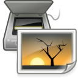
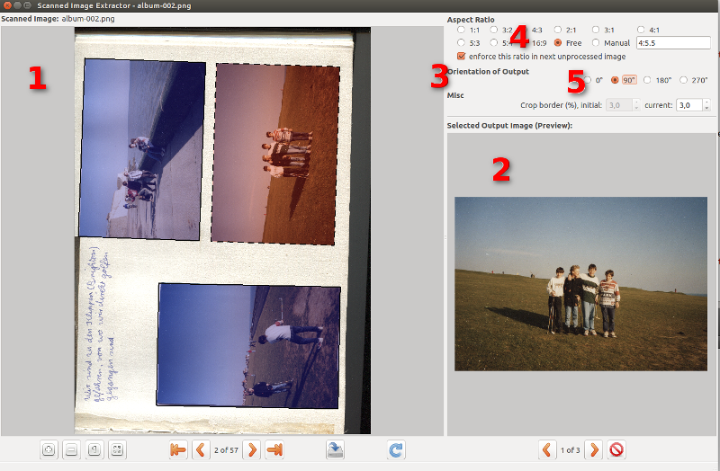

# Scanner Image Extractor



This is a fork of [Scanner Image Extractor](http://www.dominik-ruess.de/scannerExtract) by [Dominik Rueß](http://www.dominik-ruess.de).

The original code would not run with modern libraries and g++ versions.
Thus, this repo uses the `nix` build system to easily and reproducibly build and package the software into a static AppImage to hopefully make it more accessible to modern systems.

## Documentation

[Full Documentation EN](http://www.dominik-ruess.de/scannerExtract/)

[Full Documentation DE](http://www.dominik-ruess.de/scannerExtract/scannerExtract_help_de.html)

These websites are also included in this repository in the `doc` directory.

### Features

Scanned Image Extractor comes with an interesting list of features.
With Scanned Image Extractor, you can:

* efficiently extract one or more photographs per scanner image.
* work on 16bit input images and have 16bit output images (useful e.g. for Gimp 2.9+ or Lightroom users).
* have detections presented from automated photograph detection. If these detections are wrong, correct, delete or add them, manually.
* constrain aspect ratios of output photographs
* use keyboard shortcuts for an even more efficient work flow 

### How to

The user interface of Scanned Image Extractor is not very sophisticated. It consists of three main areas, one displaying the scanned image (1), one for the preview of the current photograph (2) and lastly, one area for the extraction settings (3), most importantly for the aspect ratio (4) and orientation (5) control.
Refer to Figure 1, “Scanned Image Extractor Screenshot” for a screenshot.



Start by loading a scanner image (File menu).
If you want to process all, just choose the first scanned image in your directory.
Now, after some computation, the detected photographs are suggested as blue boxes in the input image.
These blue boxes will be extracted to a specified directory (see settings) as digital photograph.
When your done with the current scanned image, proceed to the next one by clicking on the respective button.
The output images of the last image will then be processed automatically, there's no need to press the "save" button every time.

Press the keys 1-9 and 0 to enforce a certain aspect ratio for the current target.

Press the keys "a", "s", "d" or "f" for fastly changing the orientation of the current target selection.

If you dislike the current detection(s) you can manipulate, delete or manually add them yourself.
Go to any edge or corner to change the size of the selected target.
If you press CTRL while dragging, this will be symmetric.
If you press SHIFT and then drag a corner of the selected rectangle, you can rotate it by dragging.
For adding a new selection, deselect all (click somewhere empty) and click at a corner of the photograph.
Keep the mouse pressed and drag the red line to another corner and release the mouse.
Now you have a new rectangle which you can resize by moving your mouse.
Click to have a new target rectangle.

## Building

Currently supported platforms:

* `x86_64-linux`

Install the `nix` package manager and run:

```txt
nix build .#
```

or

```txt
nix build .#appImage
```

to build a statically linked AppImage.

## Original README

```txt
/***********************************************************************
 * This file is part of Scanned Image Extractor.
 *
 * Scanned Image Extractor is free software: you can redistribute it and/or modify
 * it under the terms of the GNU General Public License as published by
 * the Free Software Foundation, either version 3 of the License, or
 * (at your option) any later version.
 *
 * Scanned Image Extractor is distributed in the hope that it will be useful,
 * but WITHOUT ANY WARRANTY; without even the implied warranty of
 * MERCHANTABILITY or FITNESS FOR A PARTICULAR PURPOSE.  See the
 * GNU General Public License for more details.
 *
 * You should have received a copy of the GNU General Public License
 * along with Scanned Image Extractor.  If not, see <http://www.gnu.org/licenses/>
 *
 *
 * Copyright (C) 2015, Dominik Rueß; info@dominik-ruess.de
 **********************************************************************/

Homepage of Scanned Image Extractor: 
http://dominik-ruess.de/scannerExtract/

#######################################################################
#  Content:                                                           #
#######################################################################

1. How to install binaries on different systems
2. How to compile on unix systems

#######################################################################
#  Installing Binaries:                                               #
#######################################################################

WINDOWS:  download the binaries and install. 
          There are no dependencies for the installation binary
          tested with Windows 7

Linux-DEB:
        tested Ubuntu 15.04 with and Ubuntu 14.04 LTS
        1. Pre-requisites:
                sudo apt-get install libqt5core5a libqt5network5 \
                     libqt5gui5 libqt5svg5 libqt5widgets5 liblbfgs0 \
                     libopencv-core2.4 libopencv-highgui2.4 \
                     libopencv-imgproc2.4
        2. install debian package:
                sudo dpkg -i scannerExtract-x.y.z.deb

Linux-RPM:
        tested with Fedora 22
        1. Pre-requisites, adapt to your architecture here:
                sudo dnf install opencv-core.x86_64  qt5-qtsvg.x86_64 \
                     qt5-qtbase.x86_64 liblbfgs-devel.x86_64 \
                     opencv.x86_64
        2. install RPM package:
                rpm --install -p scannerExtract-x.y.z.rpm                

#######################################################################
#  Compile on unix systems:                                           #
#######################################################################

Tested with Ubuntu 15.04

1. pre-requisites
        sudo apt-get install liblbfgs-dev libopencv-dev libqt5svg5-dev \
             qttools5-dev-tools qttools5-dev qtbase5-dev cmake 

2. build (tested on Ubuntu 15.04)
        - commands:
                mkdir build
                cd build
                cmake path/to/scannerExtract-X.Y.Z/scannerExtract/ \
                      -DCMAKE_BUILD_TYPE=release -DOPENCV2=1
                make
                (make install)
        - note: if you use OpenCV2 (e.g. Ubuntu 15.04) then add 
          -DOPENCV2=1 to your cmake call

3. run
        "./scannedImageExtractor" or if installed "scannedImageExtractor"

```
